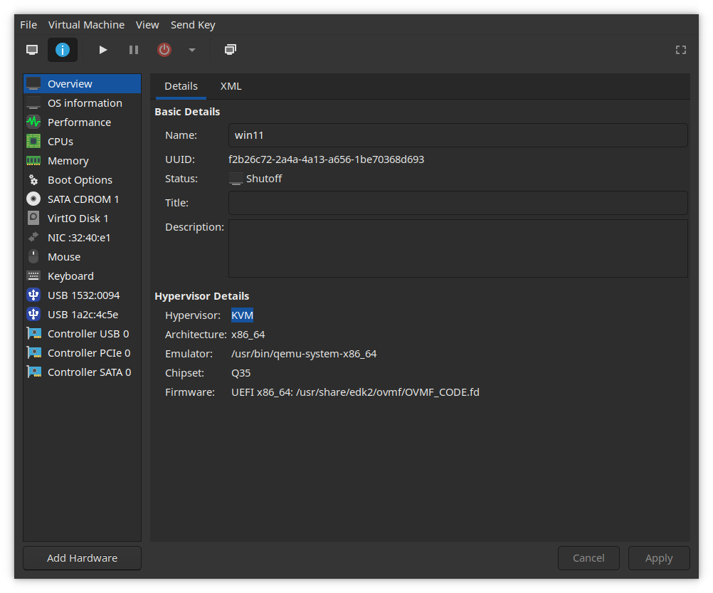

<!-- <h1 style="margin-left: 0"> VFIO GPU Configuration</h1> -->

<h1 style="margin-left: 0">VFIO GPU-Passthrough</h1>

<!-- <h1 style="margin-left: 0">VFIO GPU Passthrough</h1> -->

**VFIO configuration for a system with 1 or more GPUs, that runs Linux + Windows with GPU acceleration simulatenously.**

**_This is useful for running:_**

- **Programs better suited** _(or only available)_ **on Windows**, such as Teamviewer, Office 365, Powershell, Anticheat games, etc.
- **Xcode** and **Final Cut Pro** on Mac OS.
- **Sandbox environments** for banking, programming, testing and building software, etc.

### Host Requirements 🖥️

|                 | _Details_                                             |
| --------------- | ----------------------------------------------------- |
| **CPU**         | Atleast 4 cores                                       |
| **Motherboard** | Decent IOMMU group separation, perhaps ACS            |
| **GPUs**        | Atleast 1 dedicated GPU                               |
| **Host OS**     | Any Linux Distro _(**Ubuntu** and **Fedora** tested)_ |

### Guest OS support 🧪


| _Guest OS_              | _Notes_                                                                                                                                                                                               | _Support_                                                                       |
| ----------------------- | ----------------------------------------------------------------------------------------------------------------------------------------------------------------------------------------------------- | ------------------------------------------------------------------------------- |
| **Windows 10/11**       | Windows 11 may require [`swtpm`](https://github.com/stefanberger/swtpm) and OVMF's `secboot.fd` UEFI variant [unless bypassed](https://www.tomshardware.com/how-to/bypass-windows-11-tpm-requirement) |     |
| **Linux Distros, BSDs** | **Linux and BSD distros** work almost flawlessly in my brief testing.                                                                                                                                 |     |
| **Mac OS**              | Mac OS works [with a supported GPU](https://dortania.github.io/GPU-Buyers-Guide/). Make sure to [apply optimizations](https://github.com/sickcodes/osx-optimizer).                                    |  |

<details>
<summary><b>Here's my setup</b></summary>

<br/>

| Category        | Hardware                              | Notes                                                                                     |
| --------------- | ------------------------------------- | ----------------------------------------------------------------------------------------- |
| **CPU**         | AMD Ryzen 9 3900X                     |                                                                                           |
| **Motherboard** | Gigabyte Aorus X570 Elite WiFi        | _I bought this board, since Gigabyte usually has good IOMMU isolation_.                   |
| **GPUs**        | 2 x NVIDIA GT 710 - (Asus & Gigabyte) | _(yes they are from the pandemic times)_                                                  |
| **Host OS**     | Fedora 37 w/ KDE Plasma               | This setup is also tested on Ubuntu 22.10 and instructions are provided along with Fedora |

</details>

## ⚡ Initial Steps

**Follow the [guide by RisingPrismTV](https://gitlab.com/risingprismtv/single-gpu-passthrough/-/wikis/home), or [this video tutorial](https://www.youtube.com/watch?v=_JTEsQufSx4) based on it.**

Brief instructions are mentioned below. _(taken from the guide)_

<!-- These link to already excellent guides made by others to avoid repetitions and potentially contradicting instructions from my side. -->

<details>
<summary><b style="font-size: 1.3rem;">1. Enable virtualization in UEFI/BIOS</b></summary>

- On Intel platforms, it's called Intel **VT-D** or **VT-x**, or simply **Intel Virtualization Technology**

- On AMD platforms, enable **SVM mode** and set IOMMU to "enabled" (**_not_** "Auto").

> **_This varies between various motherboards. Refer to your motherboard's user manual._**

**_For example:_**

- Intel (ASUS): https://www.asus.com/support/FAQ/1043786/

</details>

<details>
<summary><b style="font-size: 1.3rem;">2. Configure GRUB</b></summary>

- Add IOMMU flags in the `GRUB_CMDLINE_LINUX` line in `/etc/default/grub`

  - **_For AMD CPUs:_** `amd_iommu=on iommu=pt`

    **_For Intel CPUs:_** `intel_iommu=on iommu=pt`

  - `iommu=pt` leads to [less overhead](https://access.redhat.com/documentation/en-us/red_hat_virtualization/4.1/html/installation_guide/appe-configuring_a_hypervisor_host_for_pci_passthrough) and thus [better performance](https://www.reddit.com/r/Proxmox/comments/hhx77k/the_importance_of_iommupt_with_gpu_pass_through_i/).

    **For example:**

    ```bash
    GRUB_CMDLINE_LINUX="rhgb quiet amd_iommu=on iommu=pt"
    ```

- Update grub

  ```bash
  # Ubuntu
  sudo grub-mkconfig -o /boot/grub/grub.cfg

  # Fedora/CentOS/RHEL
  sudo grub2-mkconfig -o /etc/grub2-efi.cfg
  ```

- Reboot your system and verify that IOMMU flags are enabled.

  ```bash
  cat /proc/cmdline | grep iommu
  ```

> Adding **`rd.driver.pre=vfio-pci`** may help if `vfio-pci` isn't being loaded instead of the vendor drivers (`nvidia` or `amdgpu`), but is not needed on most systems.

</details>

<details>
<summary><b style="font-size: 1.3rem;">3. Verify IOMMU groups</b></summary>

- You can only passthrough all the devices in an IOMMU group.

  That's why it is best if your GPU is in its own separate IOMMU group, or the components of your GPU are in their own isolated group.

- If not, then you will need to also passthrough every other device in that IOMMU group, which isn't always desirable or possible.

- To check your IOMMU groups, run this in your terminal: _(source: [Archwiki](https://wiki.archlinux.org/title/PCI_passthrough_via_OVMF#Ensuring_that_the_groups_are_valid))_

  ```bash
  #!/bin/bash
  shopt -s nullglob
  for g in $(find /sys/kernel/iommu_groups/* -maxdepth 0 -type d | sort -V); do
    echo "IOMMU Group ${g##*/}:"
    for d in $g/devices/*; do
        echo -e "\t$(lspci -nns ${d##*/})"
    done;
  done;
  ```

    <details>
    <summary><b><i>My sample output</i></b></summary>

  <b>Notice that I have two GT 710 GPUs in IOMMU Group 22 and 25 respectively, each having a VGA and Audio component with no other device in the group.</b>

  ```bash
  IOMMU Group 0:
        00:01.0 Host bridge [0600]: Advanced Micro Devices, Inc. [AMD] Starship/Matisse PCIe Dummy Host Bridge [1022:1482]
  IOMMU Group 1:
        00:01.1 PCI bridge [0604]: Advanced Micro Devices, Inc. [AMD] Starship/Matisse GPP Bridge [1022:1483]
  IOMMU Group 2:
        00:01.2 PCI bridge [0604]: Advanced Micro Devices, Inc. [AMD] Starship/Matisse GPP Bridge [1022:1483]
  IOMMU Group 3:
        00:02.0 Host bridge [0600]: Advanced Micro Devices, Inc. [AMD] Starship/Matisse PCIe Dummy Host Bridge [1022:1482]
  IOMMU Group 4:
        00:03.0 Host bridge [0600]: Advanced Micro Devices, Inc. [AMD] Starship/Matisse PCIe Dummy Host Bridge [1022:1482]
  IOMMU Group 5:
        00:03.1 PCI bridge [0604]: Advanced Micro Devices, Inc. [AMD] Starship/Matisse GPP Bridge [1022:1483]
  IOMMU Group 6:
        00:04.0 Host bridge [0600]: Advanced Micro Devices, Inc. [AMD] Starship/Matisse PCIe Dummy Host Bridge [1022:1482]
  IOMMU Group 7:
        00:05.0 Host bridge [0600]: Advanced Micro Devices, Inc. [AMD] Starship/Matisse PCIe Dummy Host Bridge [1022:1482]
  IOMMU Group 8:
        00:07.0 Host bridge [0600]: Advanced Micro Devices, Inc. [AMD] Starship/Matisse PCIe Dummy Host Bridge [1022:1482]
  IOMMU Group 9:
        00:07.1 PCI bridge [0604]: Advanced Micro Devices, Inc. [AMD] Starship/Matisse Internal PCIe GPP Bridge 0 to bus[E:B] [1022:1484]
  IOMMU Group 10:
        00:08.0 Host bridge [0600]: Advanced Micro Devices, Inc. [AMD] Starship/Matisse PCIe Dummy Host Bridge [1022:1482]
  IOMMU Group 11:
        00:08.1 PCI bridge [0604]: Advanced Micro Devices, Inc. [AMD] Starship/Matisse Internal PCIe GPP Bridge 0 to bus[E:B] [1022:1484]
  IOMMU Group 12:
        00:14.0 SMBus [0c05]: Advanced Micro Devices, Inc. [AMD] FCH SMBus Controller [1022:790b] (rev 61)
        00:14.3 ISA bridge [0601]: Advanced Micro Devices, Inc. [AMD] FCH LPC Bridge [1022:790e] (rev 51)
  IOMMU Group 13:
        00:18.0 Host bridge [0600]: Advanced Micro Devices, Inc. [AMD] Matisse/Vermeer Data Fabric: Device 18h; Function 0 [1022:1440]
        00:18.1 Host bridge [0600]: Advanced Micro Devices, Inc. [AMD] Matisse/Vermeer Data Fabric: Device 18h; Function 1 [1022:1441]
        00:18.2 Host bridge [0600]: Advanced Micro Devices, Inc. [AMD] Matisse/Vermeer Data Fabric: Device 18h; Function 2 [1022:1442]
        00:18.3 Host bridge [0600]: Advanced Micro Devices, Inc. [AMD] Matisse/Vermeer Data Fabric: Device 18h; Function 3 [1022:1443]
        00:18.4 Host bridge [0600]: Advanced Micro Devices, Inc. [AMD] Matisse/Vermeer Data Fabric: Device 18h; Function 4 [1022:1444]
        00:18.5 Host bridge [0600]: Advanced Micro Devices, Inc. [AMD] Matisse/Vermeer Data Fabric: Device 18h; Function 5 [1022:1445]
        00:18.6 Host bridge [0600]: Advanced Micro Devices, Inc. [AMD] Matisse/Vermeer Data Fabric: Device 18h; Function 6 [1022:1446]
        00:18.7 Host bridge [0600]: Advanced Micro Devices, Inc. [AMD] Matisse/Vermeer Data Fabric: Device 18h; Function 7 [1022:1447]
  IOMMU Group 14:
        01:00.0 Non-Volatile memory controller [0108]: Samsung Electronics Co Ltd NVMe SSD Controller 980 [144d:a809]
  IOMMU Group 15:
        02:00.0 PCI bridge [0604]: Advanced Micro Devices, Inc. [AMD] Matisse Switch Upstream [1022:57ad]
  IOMMU Group 16:
        03:02.0 PCI bridge [0604]: Advanced Micro Devices, Inc. [AMD] Matisse PCIe GPP Bridge [1022:57a3]
  IOMMU Group 17:
        03:03.0 PCI bridge [0604]: Advanced Micro Devices, Inc. [AMD] Matisse PCIe GPP Bridge [1022:57a3]
  IOMMU Group 18:
        03:04.0 PCI bridge [0604]: Advanced Micro Devices, Inc. [AMD] Matisse PCIe GPP Bridge [1022:57a3]
  IOMMU Group 19:
        03:08.0 PCI bridge [0604]: Advanced Micro Devices, Inc. [AMD] Matisse PCIe GPP Bridge [1022:57a4]
        07:00.0 Non-Essential Instrumentation [1300]: Advanced Micro Devices, Inc. [AMD] Starship/Matisse Reserved SPP [1022:1485]
        07:00.1 USB controller [0c03]: Advanced Micro Devices, Inc. [AMD] Matisse USB 3.0 Host Controller [1022:149c]
        07:00.3 USB controller [0c03]: Advanced Micro Devices, Inc. [AMD] Matisse USB 3.0 Host Controller [1022:149c]
  IOMMU Group 20:
        03:09.0 PCI bridge [0604]: Advanced Micro Devices, Inc. [AMD] Matisse PCIe GPP Bridge [1022:57a4]
        08:00.0 SATA controller [0106]: Advanced Micro Devices, Inc. [AMD] FCH SATA Controller [AHCI mode] [1022:7901] (rev 51)
  IOMMU Group 21:
        03:0a.0 PCI bridge [0604]: Advanced Micro Devices, Inc. [AMD] Matisse PCIe GPP Bridge [1022:57a4]
        09:00.0 SATA controller [0106]: Advanced Micro Devices, Inc. [AMD] FCH SATA Controller [AHCI mode] [1022:7901] (rev 51)
  IOMMU Group 22:
        04:00.0 VGA compatible controller [0300]: NVIDIA Corporation GK208B [GeForce GT 710] [10de:128b] (rev a1)
        04:00.1 Audio device [0403]: NVIDIA Corporation GK208 HDMI/DP Audio Controller [10de:0e0f] (rev a1)
  IOMMU Group 23:
        05:00.0 Network controller [0280]: Intel Corporation Dual Band Wireless-AC 3168NGW [Stone Peak] [8086:24fb] (rev 10)
  IOMMU Group 24:
        06:00.0 Ethernet controller [0200]: Intel Corporation I211 Gigabit Network Connection [8086:1539] (rev 03)
  IOMMU Group 25:
        0a:00.0 VGA compatible controller [0300]: NVIDIA Corporation GK208B [GeForce GT 710] [10de:128b] (rev a1)
        0a:00.1 Audio device [0403]: NVIDIA Corporation GK208 HDMI/DP Audio Controller [10de:0e0f] (rev a1)
  IOMMU Group 26:
        0b:00.0 Non-Essential Instrumentation [1300]: Advanced Micro Devices, Inc. [AMD] Starship/Matisse PCIe Dummy Function [1022:148a]
  IOMMU Group 27:
        0c:00.0 Non-Essential Instrumentation [1300]: Advanced Micro Devices, Inc. [AMD] Starship/Matisse Reserved SPP [1022:1485]
  IOMMU Group 28:
        0c:00.1 Encryption controller [1080]: Advanced Micro Devices, Inc. [AMD] Starship/Matisse Cryptographic Coprocessor PSPCPP [1022:1486]
  IOMMU Group 29:
        0c:00.3 USB controller [0c03]: Advanced Micro Devices, Inc. [AMD] Matisse USB 3.0 Host Controller [1022:149c]
  IOMMU Group 30:
        0c:00.4 Audio device [0403]: Advanced Micro Devices, Inc. [AMD] Starship/Matisse HD Audio Controller [1022:1487]
  ```

  </details>

- If your IOMMU groups aren't very isolated, trying enabling "ACS/ARI" option for better IOMMU grouping on most motherboards.

**Also checkout:**

- [Archwiki - PCI Passthrough](https://wiki.archlinux.org/title/PCI_passthrough_via_OVMF)

- [ASRock Deskmini ACS](https://www.reddit.com/r/ASRock/comments/pfza16/deskmini_x300_bios_with_acs_enable/)

- [Unraid GPU passthrough](https://forums.unraid.net/topic/87557-guide-asrock-x570-taichi-vm-w-hardware-passthrough/)

- [Ryzen 5000 APUs IOMMU](https://www.reddit.com/r/VFIO/comments/pd7ktr/comment/haspc9y/)

</details>

<details>
<summary><b style="font-size: 1.3rem;">4. Configure Libvirt</b></summary>

- Installing Packages:

  - **Ubuntu:**

  ```bash
  sudo apt install qemu virt-manager ovmf
  ```

  - **Fedora:**

  ```bash
  sudo dnf install "@virtualization" edk2-ovmf
  ```

- Enable libvirt service

```bash
sudo systemctl enable --now libvirtd
```

- Reboot for sanity, and then DONE!

</details>

<!-- <h2 style="margin-left: 0">Single-GPU Setup</h2> -->

<h2 style="margin-left: 0">Dual-GPU Setup</h2>

**This is for when you have two or more graphics cards, or are willing to use the integrated graphics for your host.**

<details>
<summary><span style="font-size: 1.5rem"><b>Fedora </b> <i>(click to expand)</i></span></summary>
<br/>

To keep it short, we will create a dracut module that will include the VFIO drivers, along with a script, in the initramfs.

The script will be responsible for loading and binding VFIO driver to the GPU.

### 1. Creating the script:

- Create a script in `/sbin/vfio-pci-override.sh` with the following contents:

```bash
#!/bin/sh
DEVICES="0000:0a:00.0 0000:0a:00.1"

for DEVICE in $DEVICES; do
        echo "vfio-pci" > /sys/bus/pci/devices/$DEVICE/driver_override
done

modprobe -i vfio-pci
```

- Here, modify the **`DEVICES`** line and enter the PCIe addresses of each component of your GPU(s), separated by a space.

- You can find the addresses of your device in `/sys/bus/pci/devices/`

> You can passthrough any PCIe device such as: SATA or NVME controllers, WiFi cards, and anything that has a properly isolated IOMMU group.

- Don't forget to set proper permissions for the script: `sudo chmod 744 /sbin/vfio-pci-override.sh`

> **_Note:_** PCIe addresses are just the slot addresses with a prefix like `0000` or `0001`. Some Xeon/Threadripper or multi-socket systems may have a device prefix of `0001` or `000a`, so double check at `/sys/bus/pci/devices/`.

### 2. Configuring dracut:

- **Create a dracut module directory called `20vfio`:**

```bash
sudo mkdir -p /usr/lib/dracut/modules.d/20vfio
```

> **20** in `20vfio` is the priority order in which dracut loads up the module while generating the initramfs.

- **Create module setup at **`/usr/lib/dracut/modules.d/20vfio/module-setup.sh`** with the following contents:**

```bash
#!/usr/bin/bash
check() {
  return 0
}
depends() {
  return 0
}
install() {
  declare moddir=${moddir}
  inst_hook pre-udev 00 "$moddir/vfio-pci-override.sh"
}
```

- **Create a symlink to the script in the module directory:**

```bash
sudo ln -s /sbin/vfio-pci-override.sh /usr/lib/dracut/modules.d/20vfio/vfio-pci-override.sh
```

- **Create a dracut config at** `/etc/dracut.conf.d/vfio.conf` **with the following contents:**

```bash
add_dracutmodules+=" vfio "
force_drivers+=" vfio vfio-pci vfio_iommu_type1 "
install_items="/usr/sbin/vfio-pci-override.sh /usr/bin/find /usr/bin/dirname"
```

- **Regenerate the initramfs:** _(for the kernel currently running)_

```bash
sudo dracut -fv --kver `uname -r`
```

This should print a lot of verbose output, and if you did everything correctly, you should see a line somewhere that says: **`Including module: vfio`**.

This is a good sign, and we can move on. Otherwise, re-check the previous steps.

<details>
<summary><b><i>My sample output</i></b></summary>

```bash
fedora:~$ sudo dracut -fv --kver `uname -r`

dracut: Executing: /usr/bin/dracut -fv --kver 6.0.10-300.fc37.x86_64
dracut: *** Including module: bash ***
dracut: *** Including module: systemd ***
dracut: *** Including module: vfio ***
dracut: *** Including module: network-manager ***
dracut: *** Including module: kernel-modules ***
dracut: *** Installing kernel module dependencies ***
dracut: *** Resolving executable dependencies ***
dracut: *** Creating image file '/boot/initramfs-6.0.10-300.fc37.x86_64.img' ***
```

</details>

- **Verify that the script is also included:** `sudo lsinitrd | grep vfio`

<details>
<summary><b><i>My sample output</i></b></summary>

```bash
vfio
lrwxrwxrwx   1 root     root           37 Nov 16 23:30 usr/lib/dracut/hooks/pre-udev/00-vfio-pci-override.sh -> ../../../../sbin/vfio-pci-override.sh
drwxr-xr-x   3 root     root            0 Nov 16 23:30 usr/lib/modules/6.0.10-300.fc37.x86_64/kernel/drivers/vfio
drwxr-xr-x   2 root     root            0 Nov 16 23:30 usr/lib/modules/6.0.10-300.fc37.x86_64/kernel/drivers/vfio/pci
-rw-r--r--   1 root     root        32156 Nov 16 23:30 usr/lib/modules/6.0.10-300.fc37.x86_64/kernel/drivers/vfio/pci/vfio-pci-core.ko.xz
-rw-r--r--   1 root     root         8608 Nov 16 23:30 usr/lib/modules/6.0.10-300.fc37.x86_64/kernel/drivers/vfio/pci/vfio-pci.ko.xz
-rw-r--r--   1 root     root        19896 Nov 16 23:30 usr/lib/modules/6.0.10-300.fc37.x86_64/kernel/drivers/vfio/vfio_iommu_type1.ko.xz
-rw-r--r--   1 root     root        14900 Nov 16 23:30 usr/lib/modules/6.0.10-300.fc37.x86_64/kernel/drivers/vfio/vfio.ko.xz
-rw-r--r--   1 root     root         3568 Nov 16 23:30 usr/lib/modules/6.0.10-300.fc37.x86_64/kernel/drivers/vfio/vfio_virqfd.ko.xz
-rwxr--r--   1 root     root          172 Nov 16 23:30 usr/sbin/vfio-pci-override.sh
```

</details>

- **Reboot and verify that vfio driver is loaded:** `lspci -nnk | grep -iP "nvidia|radeon|vfio-pci"`

</details>

<details>
<!-- <summary><b style="font-size: 1.5rem"> Ubuntu</b></summary> -->

<summary><span style="font-size: 1.5rem"><b>Ubuntu </b> <i>(click to expand)</i></span></summary>

<h3 style="color: yellow;"> <i>[Work in progress]</i> </h3>

</details>

## 🚀 Running the VM with GPU

This assumes you already have a **_functional Virtual Machine_** running Windows, Linux, or MacOS. If not, then follow these guides for: [**Windows**](https://www.youtube.com/watch?v=8Xnmfqqyq4c) , [**MacOS Catalina**](https://www.youtube.com/watch?v=FbOc1cqIQcI) , [**MacOS Big Sur and above**](https://youtu.be/_JTEsQufSx4).

[**_Remove virtual display (Spice/VNC) and sound adpaters_**](<https://gitlab.com/risingprismtv/single-gpu-passthrough/-/wikis/8)-Attaching-the-GPU-to-your-VM>) after passing the graphics card, if you haven't already.

**_Now that our cake is (hopefully) ready, we can finally eat it!_**

#### _Make sure your VM meets these requirements:_

| Name                     | Details                                                                                               |
| ------------------------ | ----------------------------------------------------------------------------------------------------- |
| Firmware (UEFI required) | Use `OVMF_CODE.secboot.fd` for Windows 11. UEFI, or variants of OVMF should work fine for other OSes. |
| vCPUs                    | 2 Cores, 2 Threads _(minimum)_                                                                        |
| Memory                   | 4096 MB _(minimum)_                                                                                   |

### Passthrough the GPU:

- Open virt manager and go to the **_Details_** section of your VM.

| _Details about my VM_                  |
| -------------------------------------- |
|  |

- Select **_Add Hardware_** and add every component of your GPU _(or every item in the IOMMU group, if isolation isn't perfect)_.

> Having an extra USB Keyboard and Mouse to passthrough will make things simpler.

| _Adding every component of my GPU_                                                                                |
| ----------------------------------------------------------------------------------------------------------------- |
|  |

- And finally, start the VM! If everything went right, you should see output on your second GPU. Now install the driver and make sure everything is stable.

### TODO:

- Ubuntu instructions, meanwhile follow [Pavol Elsig's tutorial](https://www.youtube.com/watch?v=ID3dlVHDl0c)

- Single GPU Setup (both Fedora and Ubuntu)

- Mention optimizations, Cassowary, hugepages, cpu pinning, Looking Glass, Virt 9p Drives etc.

## Credits (and helpful links)

This setup was made possible by using bits and pieces from these amazing guides:

- [**Fedora Ultimate VFIO Guide**](https://forum.level1techs.com/t/fedora-33-ultimiate-vfio-guide-for-2020-2021-wip/163814) by _Level1Techs_

- [**Fedora Single GPU Passthrough Tutorial**](https://www.youtube.com/watch?v=eTWf5D092VY) by [_BlandManStudios_](https://www.youtube.com/c/BlandManStudios)

- [**Single GPU Passthrough Wiki**](https://gitlab.com/risingprismtv/single-gpu-passthrough/-/wikis/home) by _RisingPrismTV_

- [**VFIO Hook helper**](https://passthroughpo.st/simple-per-vm-libvirt-hooks-with-the-vfio-tools-hook-helper/) by _Passthroughpost_

### You may find helpful:

- [**Complete Single GPU Passthrough**](https://github.com/QaidVoid/Complete-Single-GPU-Passthrough) by **QaidVoid**

- SomeOrdinaryGamers - [**Windows Single GPU passthrough**](https://www.youtube.com/watch?v=BUSrdUoedTo)

#### Icons provided by Flaticon:

[Dual GPU icon](https://cdn-icons-png.flaticon.com/512/2656/2656271.png): <a href="https://www.flaticon.com/free-icons/gpu" title="gpu icons">Gpu icons created by vectorsmarket15 - Flaticon</a>

<!-- [Single Red GPU icon](https://cdn-icons-png.flaticon.com/512/5708/5708095.png): <a href="https://www.flaticon.com/free-icons/gpu" title="gpu icons">Gpu icons created by smashingstocks - Flaticon</a> -->

<!-- [Three fan gray GPU](https://cdn-icons-png.flaticon.com/512/2359/2359863.png): <a href="https://www.flaticon.com/free-icons/gpu" title="gpu icons">Gpu icons created by Ken111 - Flaticon</a> -->

[Three fan black GPU](https://cdn-icons-png.flaticon.com/512/2291/2291961.png): <a href="https://www.flaticon.com/free-icons/graphics-card" title="graphics-card icons">Graphics-card icons created by Smashicons - Flaticon</a>

<!-- [Yellow - brown GPU](https://cdn-icons-png.flaticon.com/512/2000/2000631.png): <a href="https://www.flaticon.com/free-icons/graphic-card" title="graphic card icons">Graphic card icons created by prettycons - Flaticon</a> -->
